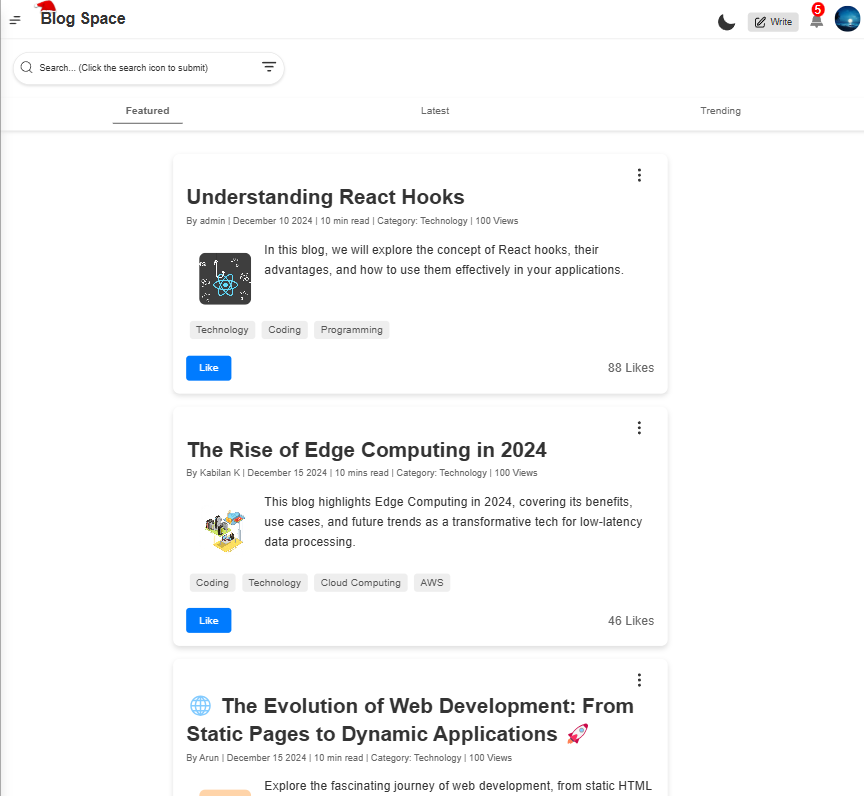
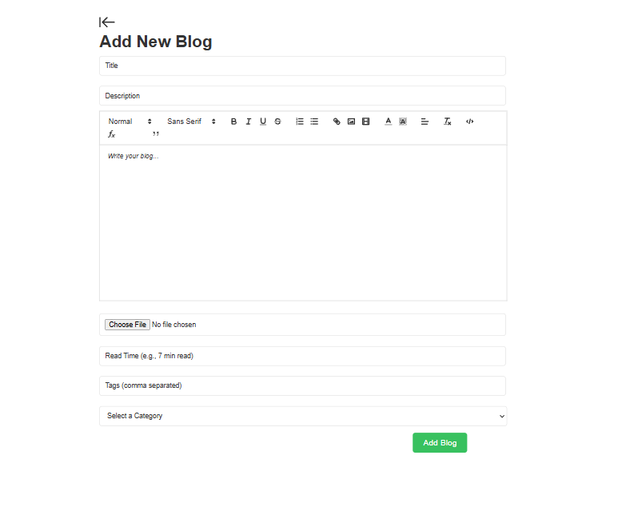
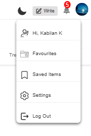

# Blog Application

A simple and user-friendly blog application where users can create and share posts easily.

## Table of Contents
- [Features](#features)
- [Tech Stack](#tech-stack)
- [How I Built It](#how-i-built-it)
- [Usage](#usage)
- [Screenshots](#screenshots)
- [FAQ](#faq)
- [Contact](#contact)

## Features
- User authentication (Login/Signup)
- Create and share posts
- Responsive UI with a modern design
- Markdown support for writing posts
- Profile management
- Dark mode support

## Tech Stack
- **Frontend**: React, TypeScript, Tailwind CSS
- **Backend**: Node.js, Express.js
- **Database**: MySQL
- **Authentication**: Session-based authentication

## How I Built It
I developed this blog application using a combination of modern web technologies. The frontend is built with React and TypeScript for strong type safety and maintainability. For styling, I used Tailwind CSS to create a clean and responsive UI.

The backend is powered by Node.js and Express.js, providing a robust API. I chose MySQL for data storage, ensuring scalability. User authentication is handled using session-based authentication instead of JWT.

## Usage
1. Register or log in to your account.
2. Create a new blog post using the rich text editor.
3. like and share your posts anytime.
4. View and like on other blog posts.

## Screenshots
### Homepage

### Create Post Page

### User Profile

## FAQ
### Can I use this application without signing up?
No, you need to create an account to write and comment on blog posts.

### Is there a dark mode?
Yes, dark mode is supported for better user experience.

### What technology was used for authentication?
Session-based authentication is used instead of JWT.

## Live Demo
You can check out the live version of the blog application here: [Live Demo](https://blogspace-app.vercel.app)

## Contact
If you have any questions or feedback, feel free to reach out to me at [kabilankavi131@gmail.com].
